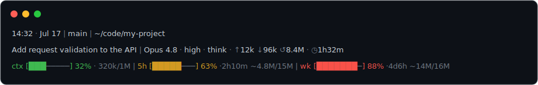

# claude-statusline


A three-line status line for the [Claude Code](https://code.claude.com) CLI that shows where you
are, what the session is doing (title + token spend), and your context-window fill and Claude.ai
plan usage (with reset countdowns) at a glance:


<sub>Plain-text rendering — bar color tracks usage: green &lt;50%, yellow 50–79%, red ≥80%.</sub>

```
14:32 · Jul 17 | main | ~/code/my-project
Add request validation to the API | Opus 4.8 · high · think · ◷1h32m · ↑12k ↓96k ↺8.4M
ctx [███─────] 32% · 320k/1M | 5h [█████───] 63% ·2h10m ~4.8M/15M | wk [███████─] 88% ·4d6h ~14M/16M
```

- **Line 1** — when and where: the clock (**time · date**), the git **branch** (only inside a
  repo), and the **current path** (`~`-abbreviated).
- **Line 2** — the session: its **title** (Claude Code's own name for the session; the folder name
  until one exists) · model, followed by the model's reasoning **effort** (`low`…`max`), a `think`
  marker when extended thinking is on, the **output style** (when not the default), the session
  **duration** (`◷`), and the session's **token counters** — `↑` input (uncached) · `↓` output ·
  `↺` cached (cache reads), the same split the
  [Claude Observatory](https://github.com/cell-observatory/claude-observatory) Stats panel shows,
  via its bundled CLI (the counters are simply omitted when it isn't installed) — each shown only
  when available.
- **Line 3** — `ctx` context-window used % **and absolute tokens used / window size**; `5h`
  rolling-5-hour plan usage %; `wk` 7-day plan usage %. Each bar is green < 50%,
  yellow 50–79%, red ≥ 80%, and shows time until reset.
  - The `5h`/`wk` bars also carry a `~` **used / total token estimate** (e.g. `~4.8M/15M`). Claude Code
    exposes only a *percentage* for those windows — never a token count — so this is a rough,
    self-calibrating figure: the script learns your tokens-per-percent from your own transcripts, then
    shows the window's used tokens over the projected 100% budget. It starts near this machine's usage
    and climbs toward your true account total as your other machines move the `%`. See below.

> **Using [Claude Observatory](https://github.com/cell-observatory/claude-observatory)?** This
> status line ships **bundled** with its CLI — `claude-observatory statusline` installs it with no
> download. This repo remains the standalone home for statusline-only setups.

## Install

**One-liner** — installs into `~/.claude` and merges a `statusLine` entry into your
`settings.json`, preserving your other settings:

```bash
curl -fsSL https://raw.githubusercontent.com/cell-observatory/claude-statusline/main/install-statusline.sh | bash
```

Prefer to look before you leap? Open [`install-statusline.sh`](install-statusline.sh) (or the raw
URL) first — it's a short, self-contained script that does exactly what's described here.

**Or clone and run:**

```bash
git clone https://github.com/cell-observatory/claude-statusline.git
cd claude-statusline
./install-statusline.sh
```

**On remote hosts (over SSH).** The installer is self-contained, so you can stream it to a box
that has no clone of this repo and no internet access — it just needs SSH + bash (+ jq):

```bash
# ad hoc, one host
ssh user@host 'bash -s' < install-statusline.sh

# one or more hosts, via the helper
./remote-install.sh user@host [user@host2 ...]
```

`remote-install.sh` runs the ad-hoc command above for each host. Set `CLAUDE_CONFIG_DIR=…` to
target a relocated config dir on the remote, or `SSH="ssh -p 2222 -i key"` (or `-J bastion`) to
customize the connection.

Then open a **fresh** `claude` session. The context bar shows immediately; the `5h`/`wk` usage
bars fill in after the first reply and only appear on Claude.ai subscription plans
(Pro/Max/Team) — until then they render a dim `—` placeholder.

The installer is idempotent — re-run it any time to refresh. It honors `$CLAUDE_CONFIG_DIR`
if you keep your Claude config somewhere other than `~/.claude` (handy on a remote/SSH box).

**Inside a devcontainer.** The status line runs wherever `claude` runs — i.e. **inside the
container** — so install it there, not on your laptop. Bake it into your `postCreateCommand` so a
rebuilt container comes back configured:

```jsonc
// .devcontainer/devcontainer.json
{
  "postCreateCommand": "curl -fsSL https://raw.githubusercontent.com/cell-observatory/claude-statusline/main/install-statusline.sh | bash",
  "remoteEnv": {
    // Optional: keep the config (and its statusline-last.json) on a mounted volume so it
    // survives rebuilds. Set the SAME value everywhere that reads it (see note below).
    "CLAUDE_CONFIG_DIR": "/workspace/.claude"
  }
}
```

Two things the container image must provide: **`jq`** (required) and a **UTF-8 locale** for the bar
glyphs (the script auto-selects one if the image ships `C.UTF-8`/`en_US.UTF-8`; otherwise add it,
e.g. `apt-get install -y locales jq`). `python3` is optional (only powers the `~` token estimate).

If you relocate `CLAUDE_CONFIG_DIR`, point **every** tool that reads it at the same path — Claude
Code, this status line, and the [Claude Observatory](https://github.com/cell-observatory/claude-observatory)
sidebar all key off it. The Observatory repo ships a ready-to-copy
[`docs/devcontainer/`](https://github.com/cell-observatory/claude-observatory/tree/main/docs/devcontainer)
template that wires up both tools (and the correct `TZ`) in one shot.

## Requirements

- **`jq`** (required — the script parses Claude Code's JSON input with it)
  - macOS: `brew install jq`
  - Debian/Ubuntu: `sudo apt-get install -y jq`
  - RHEL/Fedora: `sudo dnf install -y jq`
- **`git`** (optional — without it the branch segment is just skipped)
- **`python3`** (optional — powers the `~` token estimate on the `5h`/`wk` bars; without it the
  bars still show their percentage. No third-party packages needed.)
- A **UTF-8 locale** for the bar glyphs (without one everything still works, the bars just may
  not render). The script auto-selects a UTF-8 locale over SSH when it can.

## The `~` token estimate (5h / wk)

Anthropic only ever tells the client a **percentage** for the 5-hour and weekly windows — never
a token count, and it doesn't publish the token budget behind them. So `~N` is a deliberate
back-of-envelope estimate, computed locally:

- On a throttled schedule (≤ every 10 min) the script sums the tokens in your own Claude Code
  transcripts (`~/.claude/projects/…`) that fall inside the current window and divides by the
  account-wide `%` to learn **tokens-per-percent**; the largest ratio it sees converges on the
  real budget.
- It then displays `est = % × tokens-per-percent`, marked `~`. Because the `%` is account-wide,
  the estimate **starts at roughly this machine's usage and climbs toward your true account
  total** as sessions on your other machines (or the web) push the `%` up.
- It's rough — model mix makes tokens-per-percent wobble, and it needs a few hours of use to
  calibrate. State lives in `~/.claude/statusline-usage.json`; **delete that file to
  recalibrate** (e.g. after a plan change). The scan is cached, so it adds well under a second.

## Files

- `statusline.sh` — the status line itself. This is the source of truth. Each turn it also writes the
  exact values it renders to `~/.claude/statusline-last.json` (ctx / 5h / week percentages, token
  used/size, and reset times), so other tools — e.g. the Claude Observatory VS Code sidebar — can show
  the same numbers outside a live turn. Safe to delete; it's rewritten on the next turn.
- `install-statusline.sh` — self-contained installer. It **embeds a verbatim copy** of
  `statusline.sh` so the one-liner above works with a single file.
- `remote-install.sh` — install on one or more remote hosts over SSH (streams the installer to
  each; no clone/internet needed on the remote).
- `LICENSE` — Apache-2.0.

## Development

`statusline.sh` is the source of truth; `install-statusline.sh` carries a verbatim copy inside a
`STATUSLINE_EOF` heredoc. **If you edit `statusline.sh`, regenerate the embedded copy** so the
two don't drift:

```bash
# replace the heredoc body in install-statusline.sh with the current statusline.sh
python3 - <<'PY'
new = open('statusline.sh').read().rstrip('\n').split('\n')
lines = open('install-statusline.sh').read().split('\n'); out=[]; i=0
while i < len(lines):
    out.append(lines[i])
    if lines[i].startswith('cat > ') and lines[i].rstrip().endswith("<<'STATUSLINE_EOF'"):
        j=i+1
        while lines[j] != 'STATUSLINE_EOF': j+=1
        out += new + ['STATUSLINE_EOF']; i=j+1; continue
    i+=1
open('install-statusline.sh','w').write('\n'.join(out))
PY
# sanity: the embedded copy must match
diff <(awk "/STATUSLINE_EOF'\$/{f=1;next}/^STATUSLINE_EOF\$/{f=0}f" install-statusline.sh) statusline.sh
```

## Uninstall

```bash
rm -f ~/.claude/statusline.sh ~/.claude/statusline-usage.json
tmp=$(mktemp); jq 'del(.statusLine)' ~/.claude/settings.json > "$tmp" && mv "$tmp" ~/.claude/settings.json
```

## License

[Apache-2.0](LICENSE) © Cell Observatory

---

<sub>Unofficial and not affiliated with Anthropic. "Claude" and "Claude Code" are trademarks of Anthropic, PBC.</sub>
